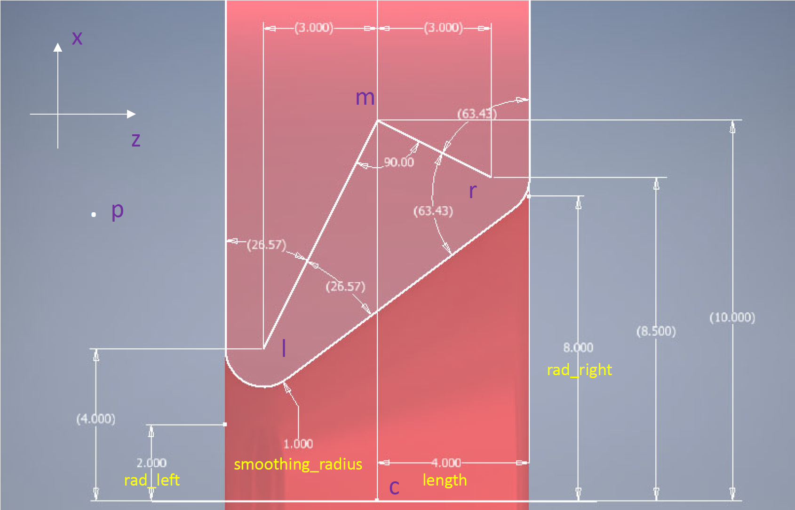

## Installations
Specificaly for use on the Advanced Computing Facility managed by the University of Tennessee.  
 1. In the repo directory,
 ```
module load python
./bootstrap.sh
srcdir=$PWD
 ```
2. For building the binary,
```
cd $builddir
$srcdir/configure \
CPPFLAGS=-I/sw/cs400_centos7.3_acfsoftware/fftw/3.3.6/centos7.3_intel17.2.174/include \
LDFLAGS=-L/sw/cs400_centos7.3_acfsoftware/python/2.7.13/centos7.3_intel17.2.174/lib \
LIBS=-L/sw/cs400_centos7.3_acfsoftware/fftw/3.3.6/centos7.3_intel17.2.174/lib 

make install
```

## Modifications to the `pore constraint`

Based on the figure above, a modification has been made to file `src/core/constraint.cpp`, i.e., the function `void calculate_pore_dist` has been rewritten as the following (See [doc/calculate_pore_dist.pdf](doc/calculate_pore_dist.pdf) for more details.)
```
void calculate_pore_dist(Particle *p1, double ppos[3], Particle *c_p, Constraint_pore *c, double *dist, double *vec)
{
  int i;
  double c_dist[3];         /* cartesian distance from pore center */
  double z , x;             /* cylindrical coordinates, coordinate system parallel to
                               pore, origin at pore centera */
  double z_vec[3], x_vec[3];/* cartesian vectors that correspond to these coordinates */
  double e_z[3], e_x[3];    /* unit vectors in the cylindrical coordinate system */
  /* helper variables, for performance reasons should the be move the the
   * constraint struct*/
     double k;// slope2, z_left, z_right;
  /* and another helper that is hopefully optmized out */
    double sec_k, fac;
//    double c1_r, c1_z, c2_r, c2_z;
    double cm_x, rad_middle;//, c_or; // centers of the rhombi
//    double cone_vector_r, cone_vector_z, p1_r, p1_z, dist_vector_z, dist_vector_r, temp;
//    double r_z,or_z;
//    double ppos2[2], pt_vec2_inside[2];
//    double e_it[2], e_in[2];
//    double left_inside_tangent[2],  right_inside_tangent[2];
//    double left_outside_tangent[2], right_outside_tangent[2];

// compute the position relative to the center of the pore; 3-vector
// compute the component parallel and perpendicular to the pore axis; 2-vector (z,r)
  z = 0.; // z direction
  for (i=0;i<3;i++) {
    c_dist[i] = ppos[i] - c->pos[i];
    z += (c_dist[i] * c->axis[i]);
  }

  x = 0.; // x direction
  for(i=0;i<3;i++) {
    z_vec[i] = z * c->axis[i];
    x_vec[i] = c_dist[i] - z_vec[i];
    x += x_vec[i]*x_vec[i];
  }
  x = sqrt(x);//>=0
// element 3-vectors
  for (i=0;i<3;i++) {
    e_z[i]  = c->axis[i];
    e_x[i]  = x_vec[i] / x;
  }

// slope of walls and check radius
  k = (c->rad_right - c->rad_left)/2./(c->length);
//  K = (c->outer_rad_right - c->outer_rad_left)/2./(c->length);
// trigonometry
  sec_k  = sqrt(1+k*k);
// center of the Rhombus
// c_z = 0; so no need to define.
  rad_middle = (c->rad_right + c->rad_left)/2.;
  cm_x = rad_middle + c->length * sec_k;
// force c->smoothing_radius to be less than or equal to c->length
  if (c->smoothing_radius >= c->length) {
    //c->smoothing_radius = c->length;
    if (x < cm_x) {
      double mp_x = x - cm_x;
      double mp   = sqrt( mp_x * mp_x + z * z );
      *dist = mp - c->length; // mp - c->smoothing_radius;
      fac = *dist / mp;
      for (i=0;i<3;i++) {
        vec[i] = fac * (z * e_z[i] + mp_x * e_x[i]);}}
    else if (z <= 0) {
      *dist = -z - c->length;
      for (i=0;i<3;i++) {
      vec[i] = -*dist * e_z[i];}}
    else {
      *dist = z - c->length;
      for (i=0;i<3;i++) {
        vec[i] = *dist * e_z[i];}}
    return;
  }
// if non conical pore, k = 0, sec_k = 1;
  if (k == 0) {
    // more declarations
    double cl_z = c->smoothing_radius - c->length;
    double cl_x = c->rad_left + c->smoothing_radius;
    double lp_z = z - cl_z;
    double lp_x = x - cl_x;
    if ((lp_z != 0) || (lp_x != 0)) {
  // left wall region
    if ((lp_x >= 0) && ((lp_z <= 0) || ((z <= 0) && (lp_x > lp_z)))) {
      *dist = -z - c->length;
      for (i=0;i<3;i++) {
        vec[i] = -*dist * e_z[i];}}
  // left pore mouth
    else if ((lp_x < 0) && (lp_z < 0)) {
      double lp = sqrt(lp_z * lp_z + lp_x * lp_x);
      *dist = lp - c->smoothing_radius;
      fac = *dist / lp;
      for (i=0;i<3;i++) {
        vec[i] = fac * (lp_z * e_z[i] + lp_x * e_x[i]);}}
    return;
    }

  // more declarations for right side
    double cr_z = c->length - c->smoothing_radius;
    double cr_x = c->rad_right + c->smoothing_radius;
    double rp_z = z - cr_z;
    double rp_x = x - cr_x;
    if ((rp_z != 0) || (rp_x != 0)) {
  // right wall region
    if ((rp_x >= 0) && ((rp_z >= 0) || ((z > 0) && ( -rp_z < rp_x)))) {
        *dist = z - c->length;
        for (i=0;i<3;i++) {
          vec[i] = *dist * e_z[i];}}
  // right pore mouth
    else if ((rp_x < 0) && (rp_z > 0)) {
      double rp = sqrt(rp_z * rp_z + rp_x * rp_x);
      *dist = rp - c->smoothing_radius;
      fac = *dist / rp;
      for (i=0;i<3;i++) {
        vec[i] = fac * (rp_z * e_z[i] + rp_x * e_x[i]);}}
    return;
  }
  // inside the pore
  *dist = rad_middle - x;
  for (i=0;i<3;i++) {
    vec[i] = -*dist * e_x[i];}
  return;
  }
// end if non conical pore

// more declarations
  double cl_z = c->smoothing_radius - c->length;
  double cl_x = c->rad_left + c->smoothing_radius * (sec_k + k);
  double lp_z = z - cl_z;
  double lp_x = x - cl_x;
  if ((lp_z != 0) || (lp_x != 0)) {
    double tan_lm = (cl_x - cm_x) / cl_z;
    double tan_lp = lp_x / lp_z;
// left wall region
    if ((lp_x >= 0) && ((lp_z <= 0) || ((z <= 0) && (tan_lp > tan_lm)))) {
      *dist = -z - c->length;
      for (i=0;i<3;i++) {
        vec[i] = -*dist * e_z[i];}}
// left pore mouth
    else if ((lp_x < 0) && ((1./tan_lp) >= -k)) {
      double lp = sqrt(lp_z * lp_z + lp_x * lp_x);
      *dist = lp - c->smoothing_radius;
      fac = *dist / lp;
      for (i=0;i<3;i++) {
        vec[i] = fac * (lp_z * e_z[i] + lp_x * e_x[i]);}}
    return;
  }

// more declarations for right side
  double cr_z = c->length - c->smoothing_radius;
  double cr_x = c->rad_right + c->smoothing_radius * (sec_k - k);
  double rp_z = z - cr_z;
  double rp_x = x - cr_x;
  if ((rp_z != 0) || (rp_x != 0)) {
    double tan_rm = (cr_x - cm_x) / cr_z;
    double tan_rp = rp_x / rp_z;
// right wall region
    if ((rp_x >= 0) && ((rp_z >= 0) || ((z > 0) && (tan_rp < tan_rm)))) {
        *dist = z - c->length;
        for (i=0;i<3;i++) {
          vec[i] = *dist * e_z[i];}}
// right pore mouth
    else if ((rp_x < 0) && ((1./tan_rp) <= -k)) {
      double rp = sqrt(rp_z * rp_z + rp_x * rp_x);
      *dist = rp - c->smoothing_radius;
      fac = *dist / rp;
      for (i=0;i<3;i++) {
        vec[i] = fac * (rp_z * e_z[i] + rp_x * e_x[i]);}}
    return;
  }

// inside the pore
  double sin_k = k / sec_k;
  double cos_k = 1. / sec_k; // minus sign for optimization

  *dist = (k*z - x + rad_middle) * cos_k;
  for (i=0;i<3;i++) {
    vec[i] = *dist * (sin_k * e_z[i] - cos_k * e_x[i]);}
  return;
}
```
