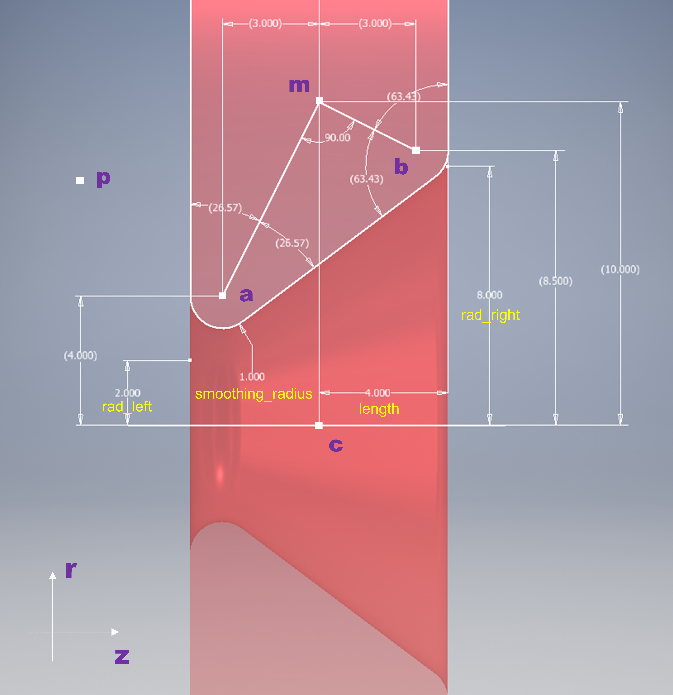
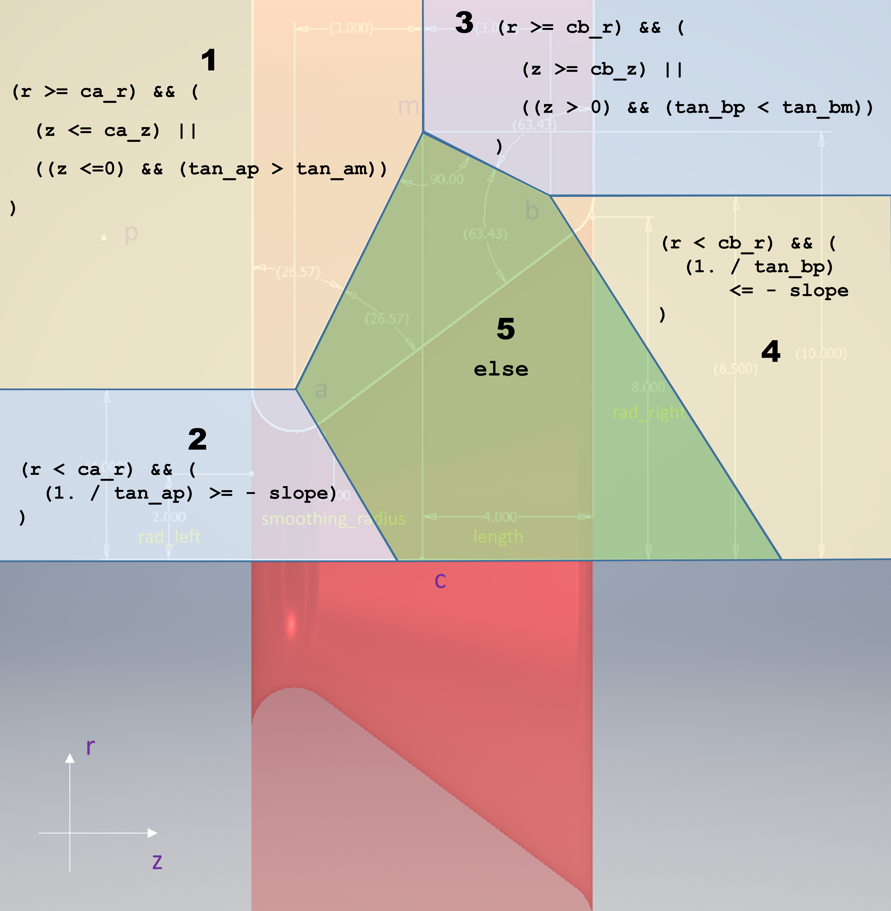

## Installations
Specificaly for use on the Advanced Computing Facility managed by the University of Tennessee.  
 1. In the repo directory,
 ```
module load python
./bootstrap.sh
srcdir=$PWD
 ```
2. For building the binary,
```
cd $builddir
$srcdir/configure \
CPPFLAGS=-I/sw/cs400_centos7.3_acfsoftware/fftw/3.3.6/centos7.3_intel17.2.174/include \
LDFLAGS=-L/sw/cs400_centos7.3_acfsoftware/python/2.7.13/centos7.3_intel17.2.174/lib \
LIBS=-L/sw/cs400_centos7.3_acfsoftware/fftw/3.3.6/centos7.3_intel17.2.174/lib 

make install
```

## Modifications to the `pore constraint`
The following figure illustrates a section view of a pore.  
**p** is the position of the partial in question.  
**c** is the midpoint of the pore axis.  
**a** and **b** are the centers of the smoothing arcs.  
**m** is the intersection of the angle bisectors.  



The following figure shows that we can divide the half plane
containing **p** into five regions.  
In each region the distance between **p** and the pore can be calculated.  


Based on the figures above, modifications have been made 
to file `src/core/constraint.cpp`, i.e., 
the function `void calculate_pore_dist` has been rewritten 
as the following (See [doc/calculate_pore_dist.pdf](doc/calculate_pore_dist.pdf) 
for more details.)
```
void calculate_pore_dist(Particle *p1, double ppos[3], Particle *c_p, Constraint_pore *c, double *dist, double *vec)
{
    /*
     *      dist and vec are the outputs
     *
     *  Step 1.
     *  compute the position of the partical relative to the center of the pore,
     *  a 3-vector: c_dist[3]
     *  compute the component parallel and perpendicular to the pore axis,
     *  a 2-vector: (double z, double r)
    */

    // c_dist[3]    cartesian vector pointing from pore center to the particle
    //                  c_dist[i] = ppos[i] - c->pos[i]

    // z, r         c_dist in cylindrical coordinates, the coordinate z axis is
    //                  the pore axis with its origin at the pore center

    // z_vec[3], r_vec[3]  z and r in carteision system
    // e_z[3], e_r[3]      unit vectors along z and r in the carteision system

    int i; // the iterator variable
    double c_dist[3];
    double z, r;
    double z_vec[3], r_vec[3];
    double e_z[3], e_r[3];

    // in z direction
    for (i = 0; i < 3; i += 1)
    {
        c_dist[i] = ppos[i] - c->pos[i];
        z += (c_dist[i] * c->axis[i]);
    }

    // in r direction
    for (i = 0; i < 3; i += 1)
    {
        z_vec[i] = z * c->axis[i];
        r_vec[i] = c_dist[i] - z_vec[i];
        r += r_vec[i]*r_vec[i];
    }
    r = sqrt( r );

    // element 3-vectors for conversions later
    for (i = 0; i < 3; i += 1)
    {
        e_z[i]  = c->axis[i];
        e_r[i]  = r_vec[i] / r;
    }

    /*  Step 2.
     *  If c->smoothing_radius is set to be greater or equal to c->length,
     *  points a, b, m are coincident.
     *  Consider c->length as the dominating parameter for the pore.
     *
     *  Else, skip to Step 3.
     *
     *  Note, for a vector pointing from point x to point y, xy_z and xy_r are
     *  the z and r component of that vector.
    */

    if (c->smoothing_radius >= c->length) {

        double cm_r = 2 * c->length;

        // particle is closer to the semi-circle

        if (r < cm_r)
        {
            double mp_r = r - cm_r;
            double mp_norm = sqrt( mp_r * mp_r + z * z );
            *dist = mp_norm - c->length; // instead of c->smoothing_radius
            double fac = *dist / mp_norm;

            for (i = 0; i < 3; i += 1)
            {
                vec[i] = fac * (z * e_z[i] + mp_r * e_r[i]);
            }
        }

        // particle is to the left of the pore

        else if (z <= 0)
        {
            *dist = -z - c->length;
            for (i = 0; i < 3; i += 1)
            {
                vec[i] = - *dist * e_z[i];
            }
        }

        // particle is to the right of the pore

        else
        {
            *dist = z - c->length;
            for (i = 0; i < 3; i += 1)
            {
                vec[i] = *dist * e_z[i];
            }
        }

        return;
    }

    /** Step 3.
     *  Identify the region relative to the pore, in that is the particle.
     *  Then calculate *dist and vec[3] (see ACF.md).
    */

    // tan_slope    tangent of the slope of the inner wall of the pore
    // sec_slope    secant of the angle corresponding to the slope

    double tan_slope = (c->rad_right - c->rad_left) / 2. / (c->length);
    double sec_slope  = sqrt(1 + tan_slope * tan_slope);

    // m is the intersection angle bisectors from smoothing centers a and b
    // 0, cm_r      z and r component of vector cm in Cylindrical system
    // rad_middle   radius at the middle of the pore inner wall

    // Note, for a vector pointing from point x to point y, xy_z and xy_r are
    // the z and r component of that vector.
    // By definition, c_z = 0, c_r = 0, p_z = z, and p_r = r .

    double rad_middle = (c->rad_right + c->rad_left) / 2.;
    double cm_r = rad_middle + c->length * sec_slope;

    // calculate components of vectors ca and ap, p is the particle
    // rad_middle   radius at the middle of the rhombi

    double ca_z = c->smoothing_radius - c->length;
    double ca_r = c->rad_left + c->smoothing_radius * (sec_slope + tan_slope);
    double ap_z = z - ca_z;
    double ap_r = r - ca_r;

    double tan_am = (ca_r - cm_r) / ca_z;
    double tan_ap = ap_r / ap_z;

    // for the right side

    double cb_z = c->length - c->smoothing_radius;
    double cb_r = c->rad_right + c->smoothing_radius * (sec_slope - tan_slope);
    double bp_z = z - cb_z;
    double bp_r = r - cb_r;

    double tan_bm = (cb_r - cm_r) / cb_z;
    double tan_bp = bp_r / bp_z;

    // left wall region (region 1 in the doc)

    if ((ap_r >= 0) && (
            (ap_z <= 0) || ((z <= 0) && (tan_ap > tan_am))
            ))
    {
        *dist = - z - c->length;
        for (i = 0; i < 3; i += 1)
        {
            vec[i] = - *dist * e_z[i];
        }
        return;
    }

    // left pore mouth (region 2 in the doc)

    if ((ap_r < 0) && ((1. / tan_ap) >= - tan_slope))
    {
        double ap_norm = sqrt(ap_z * ap_z + ap_r * ap_r);
        *dist = ap_norm - c->smoothing_radius;
        double fac = *dist / ap_norm;

        for (i = 0; i < 3; i += 1)
        {
            vec[i] = fac * (ap_z * e_z[i] + ap_r * e_r[i]);
        }
        return;
    }

    // right wall region (region 3 in the doc)

    if ((bp_r >= 0) && (
            (bp_z >= 0) || ((z > 0) && (tan_bp < tan_bm))
            ))
    {
        *dist = z - c->length;
        for (i = 0; i < 3; i += 1)
        {
            vec[i] = *dist * e_z[i];
        }
        return;
    }

    // right pore mouth (region 4 in the doc)

    if ((bp_r < 0) && ((1. / tan_bp) <= - tan_slope))
    {
        double bp_norm = sqrt(bp_z * bp_z + bp_r * bp_r);
        *dist = bp_norm - c->smoothing_radius;
        double fac = *dist / bp_norm;

        for (i = 0; i < 3; i += 1)
        {
            vec[i] = fac * (bp_z * e_z[i] + bp_r * e_r[i]);
        }
        return;
    }

    // inside the pore (region else in the doc)

    double sin_slope = tan_slope / sec_slope;
    double cos_slope = 1. / sec_slope;

    *dist = (tan_slope * z - r + rad_middle) * cos_slope;

    for (i = 0; i < 3; i += 1)
    {
        vec[i] = *dist * (sin_slope * e_z[i] - cos_slope * e_r[i]);
    }
    return;

} // END void calculate_pore_dist()
```
